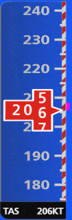

# G1000 (flight instruments)

> This project don't have deployed version. You can only see code [here](./code-example/HorizontalSituationIndicator) (horizontal situation indicator).

> Second part of the project you can see [here](https://github.com/tppd67421/G1000-menu).

> :warning: **Warning!** This page have many gif files. Maybe will be needed more time for load.

## Technologies used

- React;
- React Konva (for canvas).

## Project description

This project represents flight instrument [G1000](https://en.wikipedia.org/wiki/Garmin_G1000), which connected with [X-Plane application](https://www.x-plane.com/). G1000 have two mode: PFD and MFD. Purpose of work was creating basic flight instruments from PFD mode. On screen you can see next aircraft instruments:

 - [Airspeed Indicator](#1-airspeed-indicator) (left side on image);
 - [Attitude Indicator](#2-attitude-indicator) (top center);
 - [Altimeter](#3-altimeter) (right);
 - [Horizontal Situation Indicator](#4-horizontal-situation-indicator) (bottom center).

All basic functionality has been created. I created 4 aviation instruments listed above.

Code (with horizontal situation indicator realization) you can see [here](./code-example/HorizontalSituationIndicator).

## Example of use

## Functionality description

### 1. Airspeed Indicator

The Airspeed Indicator displays airspeed on a moving tape rolling number gauge. The numeric labels and major tick marks on the moving tape are shown at intervals of 10 knots. The minor tick marks on the moving tape are shown at intervals of 5 knots. This indicator contains next elements:

- airspeed text (bottom, nearby 'KT');
- airspeed indicator (black or red block);
- digit scale;
- colored scale;
- airspeed trend (magenta line on right side).

### 2. Attitude Indicator

The Attitude Indicator displays the pitch, roll, and slip/skid information. Main elements:

- aircraft symbol (yellow arrows on center);
- roll scale (circular scale on top side);
- slip/skid indicator (trapezoid under arrow);
- pitch scale (vertical scale).

### 3. Altimeter

Main properties, which display this instrument:

- altimeter (black block on center);
- vertical speed (black arrow on right side);
- barometric setting (turquoise numbers on bottom side);
- altitude alerting (top side).

This main features, which was be implemented. Other features will be implemented later.

### 4. Horizontal Situation Indicator

The Horizontal Situation Indicator (HSI) displays a rotating compass card in a heading-up orientation. Letters indicate the cardinal points with numeric labels every 30˚. Major tick marks are at 10˚ intervals and minor tick marks are at 5˚ intervals. This insrument have:

- current heading (top center);
- selected heading and heading bug (turquoise numbers on left top side and turquoise bug on compass);
- selected course and course pointer (magents numbers on right top side and magenta arrow on center compass);
- course deviation indicator (center part in course pointer);
- to/from indicator (arrow, which moved on course pointer);
- navigation source (word which a little bit shifted from center compass: 'GPS', 'VOR1', 'VOR2');
- current track indicator (magenta diamond under current heading);
- turn rate and heading trend vector (ellipsed line under current heading);
- bearing pointers and information windows (on bottom side around compass);
- wind direction and wind speed (left side).

Example how work CDI you can see in next animation.

Also compass have 2 view type: full size and in bottom side screen.

In X-plane you can set wind direction and wind speed.

